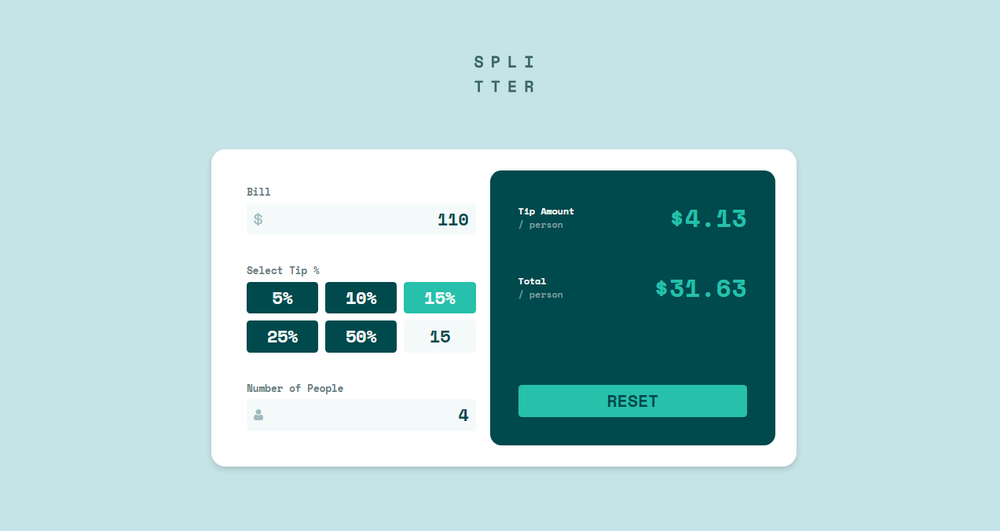

# Frontend Mentor - Tip calculator app solution

This is a solution to the [Tip calculator app challenge on Frontend Mentor](https://www.frontendmentor.io/challenges/tip-calculator-app-ugJNGbJUX). Frontend Mentor challenges help you improve your coding skills by building realistic projects.

## Table of contents

- [Overview](#overview)
  - [The challenge](#the-challenge)
  - [Screenshot](#screenshot)
  - [Links](#links)
- [My process](#my-process)
  - [Built with](#built-with)
  - [What I learned](#what-i-learned)
  - [Continued development](#continued-development)
  - [Useful resources](#useful-resources)
- [Author](#author)

## Overview

### The challenge

Users should be able to:

- View the optimal layout for the app depending on their device's screen size
- See hover states for all interactive elements on the page
- Calculate the correct tip and total cost of the bill per person

### Screenshot



### Links

- Live Site URL: [Demo](https://phenomenal-gaufre-05dd12.netlify.app)

## My process

### Built with

- Semantic HTML5 markup
- CSS custom properties
- Flexbox
- CSS Grid
- [React](https://reactjs.org/) - JS library

### What I learned

I implemented a 3-column responsive grid layout for tip buttons using CSS Grid that adapts seamlessly across device sizes. Using custom CSS saved development time while providing ideal spacing/alignment as we expand the number of buttons.


```css
.Buttons {
  display: grid;
  grid-template-columns: repeat(3, 1fr);
  grid-gap: 10px;
}
```

The NumberInput component demonstrates reusable React components. Key learnings:

Accepts props like title, placeholder, icon to customize rendering
Handles errors by conditionally applying "error" CSS class
Uses CSS Modules for component-scoped styling
Destructures props for readability and spreads rest to input
Allows hooking into events/callbacks passed via props
In summary, this component shows best practices like:

Reusability through customization via props
Local state management and styling
Input validation and error handling
Proper use of ES6 features like destructuring
Event handling through callbacks
These learnings can facilitate building reusable input components in React. The component encapsulates complex logic behind a clean interface

```js
import React from "react";
import "./NumberInput.css";

const NumberInput = ({
  title,
  placeholder,
  icon,
  error,
  ...otherProps
}) => {
  return (
    <div className="number-input">
      <div className="title-container">
        <label htmlFor="number-input" className="title"> {title} </label>
        <label htmlFor="number-input" className="error"> {error} </label>
      </div>
      <div className="input-container">
        
        <input
          type="number"
          placeholder={placeholder}
          className={`number-input-field ${error ? "error" : ""}`}
          min={0}
          {...otherProps}
        />
      </div>
    </div>
  );
};

export default NumberInput;

```

### Continued development

While I feel comfortable with React fundamentals, there are some more advanced capabilities I aim to refine in upcoming projects. Specifically, I want to enhance my CSS skills in order to create visually polished React applications. Learning CSS frameworks like Tailwind could simplify style encapsulation and customization. Additionally, implementing animations and transitions would elevate interactivity. React Spring is a useful library to achieve such layering on top of React components. 

### Useful resources

- [A Complete Guide to Flexbox](https://css-tricks.com/snippets/css/a-guide-to-flexbox/) - The Complete Guide to Flexbox, provided by CSS-Tricks, offers a comprehensive resource for understanding and using the Flexbox layout module.

## Author

- GitHub - [@emazaheri](https://github.com/emazaheri)
- Frontend Mentor - [@emazaheri](https://www.frontendmentor.io/profile/emazaheri)
- LinkedIn - [@emazaheri](https://www.linkedin.com/in/emazaheri/)